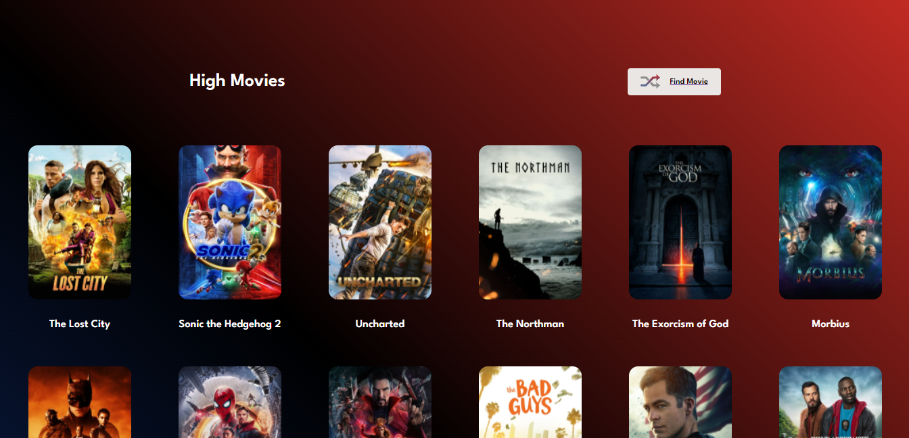
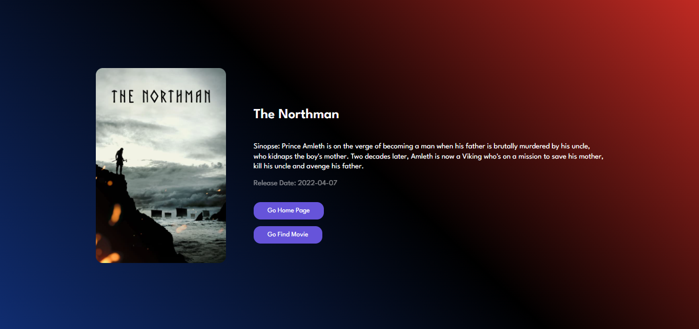
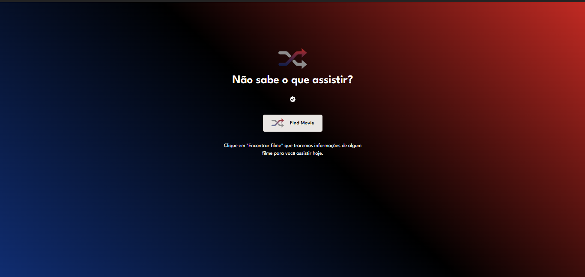

<h1 align="center"> RocketFlix - GCFlix </h1>

## 🚀 Tecnologias utilizadas

- React
- React Router Dom
- React Icons
- Styled components

## 🚀 Linguagem utilizada

- JavaScript

## 💻 Sobre o Projeto

Esse projeto foi feito com base em um projeto feito pela
<a href="https://www.youtube.com/c/GirlCoding">Girl Coding</a>,
e aprimorado com base em desafio da Rockseat
<a href="https://efficient-sloth-d85.notion.site/Desafio-Rocketflix-5ca1c56b5e52473eb12e8b2bc3ab1b8d#06e6ecb4212447c695dfbe7da61ec551">notion do desafio</a>. 

O projeto tem como base pegar de uma api os 20 filmes mais populares do momento e mostrar em tela, podendo ver a capa, sinopse do Filme a data de lançamento.  
Também tendo uma parte em que você pode clicar em um botão e ele te trás um filme aleatório mostrando também a capa e a sinopse.

## Video do projeto
 <a href="https://www.youtube.com/watch?v=TAtQOSZXlkg">
    - Link do Video
 </a>
  

 ## Imagens do projeto

 

 

 
   

 By Diego Silva 

